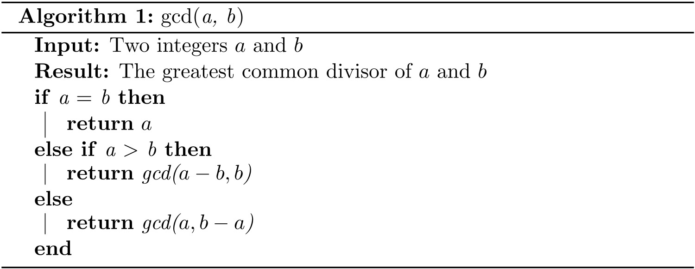
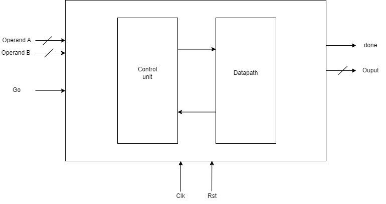
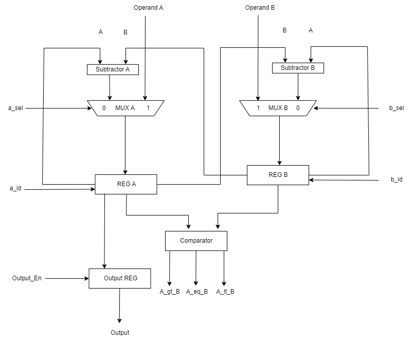
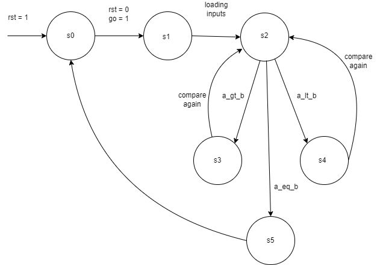
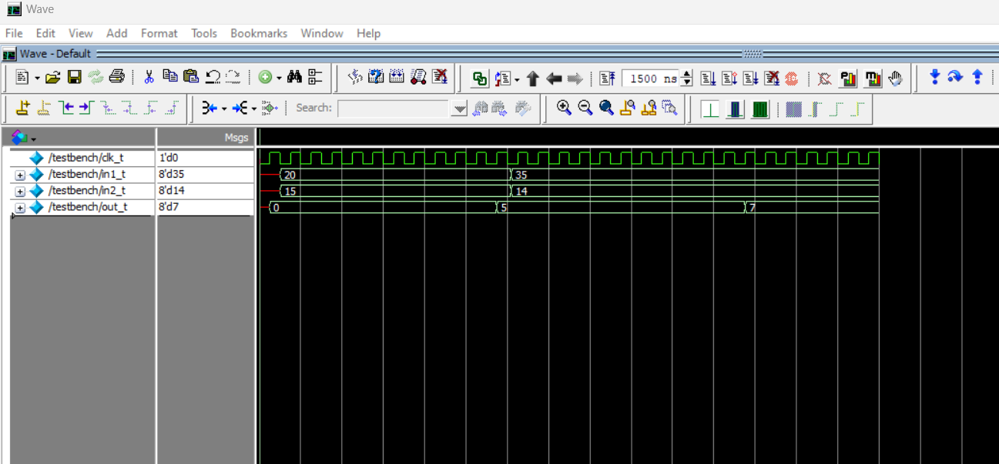

# GCD Calculator Datapath
A GCD Calculator Datapath, it is a circuit that can find the greatest common divisor between two non-zeros. This the largest positive integer that divides each of the numbers in the set without remainder.                     

We used the Euclid’s Algorithm for finding the greatest common divisor of two integers:

This is the block diagram of the ciruit.

The circuit consists of two parts:
1. Datapath
2. Controller to control the datapath

This is the Datapath diagram.

The Datapath consists of the following:

•	2x Multiplexer:
  Used to select between the value of the external world and the value coming from the Datapath itself.

•	2x Subtractor:
  To subtract the small value from the large value, one of them that its value that is being forward to the comparator to be compare with the other value.

•	3x Register:
  Two for temporary storing the values that is coming from the multiplexers, and for the output.

•	1x Comparator:
  For comparing the two values, if one of them is less than the other the circuit will continue looping until they are equal.

This is the FSM for the Controller.

The controller controls cases step by step in Datapath it can change from the current state to the next state and based on certain conditions.
If the reset is high, the current state will stay in s0.
if the reset is low and go is high the controller begins to transition from one state to another, starting from state s0 moving to state s1 to load the inputs from the external world, then it moves to state s2 to compare between the two values, If one the two values is greater than the other the controller moves to state s3 or s4 based on the which value is the greater value e.g. if A is greater than B the controller moves to state s3 and in this state it loads the value A again from the register A to the subtractor A to subtract B from A moving back again to state s2 to compare the values again, and the same in B, if the values are equal the controller moves to state s5 telling that the value is ready and it will raise the done signal, after that it will return to the s0 for starting new operation.

The simulation was done on questa starter edition, it's free software from intel, you can download it from [here](https://www.intel.com/content/www/us/en/software-kit/757227/questa-intel-fpgas-standard-edition-software-version-22-1.html)

